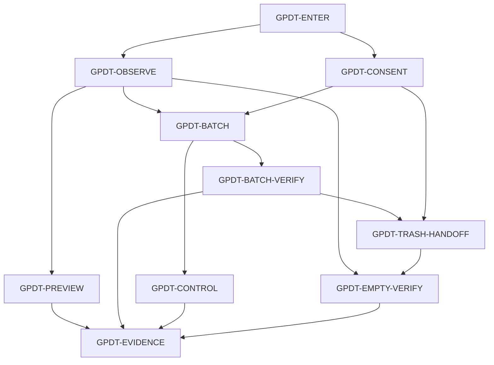

# Google Photos Delete Tool identity graph

The destination is [vision.md](vision.md). This graph records durable product
identities, fates, and true dependency edges, not a work queue, release status,
or claim that a live browser run has passed.

One colloquial name has one row and one fate (`live`, `dead`, or
`rename-to:<ID>`). Every identity below is `live`. This conversion does not
invent a second destination: IDs, identity text, edges, and done-when oracles
are unchanged.

## Graph

Edges point from prerequisite to consumer. The table is authority if this
picture omits or invents an edge.

## Registry

| ID | Identity | Fate | Depends on | Done when |
| --- | --- | --- | --- | --- |
| GPDT-ENTER | Enter a supported, locally controlled surface | live | — | The extension or userscript activates only for `photos.google.com`, identifies the chosen current view as the action scope, and offers a click-free dry-run before destructive work. |
| GPDT-OBSERVE | Interpret the current Google Photos DOM fail closed | live | GPDT-ENTER | A versioned pack identifies media tiles, selection state, scroll container, dialogs, and destructive candidates; action candidates require a pack-owned exact action selector or positive accessible text, unknown DOM returns no candidate, and bounded diagnostics retain the pack and observed match evidence. |
| GPDT-PREVIEW | Preview the current-view scope without mutation | live | GPDT-OBSERVE | The dry-run path scrolls and counts observed matching labels without invoking any click, clearly treats deduplicated label counts as browser observations, and can be stopped without becoming a destructive run. |
| GPDT-CONSENT | Admit explicit destructive intent | live | GPDT-ENTER | Every non-dry run is refused when the shared local consent acknowledgement is absent or unreadable, and choosing the permanent empty-trash option makes that consequence visible before admission. |
| GPDT-BATCH | Move matching media to Trash through bounded actions | live | GPDT-OBSERVE, GPDT-CONSENT | The engine selects only currently unchecked matching tiles up to the configured positive batch limit, bounds selection settling, scroll settling, end-of-list detection, and action/dialog waits, and clicks delete and confirm only after positive identification. |
| GPDT-BATCH-VERIFY | Verify each recoverable deletion batch | live | GPDT-BATCH | After confirmation, the engine waits within the action timeout for the selected count to return to zero, increments the deleted total only after that observation, flushes a final partial batch, and reports timeout or selector drift as error instead of `done`. |
| GPDT-CONTROL | Keep a run under present user control | live | GPDT-BATCH | Pause holds progress, resume continues the same engine, stop interrupts action waits and resolves to idle, and a supported surface cannot start a second engine while the first run is settling. |
| GPDT-TRASH-HANDOFF | Bound navigation into the permanent Trash flow | live | GPDT-BATCH-VERIFY, GPDT-CONSENT | Navigation occurs only when the explicit empty-trash option survived a clean real run that deleted at least one item; a successfully persisted handoff is consumed once, expires after three minutes, and is accepted only on `/trash` or its subpaths. |
| GPDT-EMPTY-VERIFY | Empty Trash only with an exact observed postcondition | live | GPDT-OBSERVE, GPDT-TRASH-HANDOFF | The flow positively identifies the empty action, dialog, and destructive confirmation within per-step timeouts, then emits `done` only after the action and dialog disappear or an explicit empty-state signal appears; ambiguous or unverifiable state emits an error. |
| GPDT-EVIDENCE | Qualify behavior against the live Google Photos surface | live | GPDT-PREVIEW, GPDT-BATCH-VERIFY, GPDT-CONTROL, GPDT-EMPTY-VERIFY | Source and local tests pass, and each release making a live claim records the disposable-account checks in `RELEASE_GATE.md`: seeded-item counts, batch resets, exact Trash contents, empty-trash postcondition, stop/restart, and a localized run. |

## Repository evidence

- `GPDT-OBSERVE`: [selector-pack.ts](../src/core/selector-pack.ts),
  [selectors.ts](../src/core/selectors.ts), and
  [selectors.test.ts](../tests/selectors.test.ts)
- `GPDT-PREVIEW`, `GPDT-BATCH`, `GPDT-BATCH-VERIFY`, and `GPDT-CONTROL`:
  [delete-engine.ts](../src/core/delete-engine.ts),
  [config.ts](../src/core/config.ts), and
  [delete-engine.test.ts](../tests/delete-engine.test.ts)
- `GPDT-CONSENT`: [page-runner.ts](../src/core/page-runner.ts),
  [content.ts](../src/extension/content.ts), and
  [ui-wiring.test.ts](../tests/ui-wiring.test.ts)
- `GPDT-TRASH-HANDOFF`: [empty-trash-baton.ts](../src/core/empty-trash-baton.ts)
  and [empty-trash-baton.test.ts](../tests/empty-trash-baton.test.ts)
- `GPDT-EMPTY-VERIFY`: [empty-trash.ts](../src/core/empty-trash.ts) and
  [empty-trash.test.ts](../tests/empty-trash.test.ts)
- `GPDT-EVIDENCE`: [RELEASE_GATE.md](RELEASE_GATE.md)

The source and tests above are source/local evidence at the repository revision
being inspected. The live-release protocol is an additional oracle, not evidence
that this documentation change performed or passed a browser run.

## Release boundary (GOV-017)

Declared 2026-08-31 per company ADR-030 and governance audit GOV-017
(`SylphxAI/owner` runbook `GOVERNANCE-AUDIT-2026-08-28.md`). Docs declaration
of current truth only. This is a personal product under the `shtse8`
organisation; its real boundary is store listings and browser scripts, not
company delivery vocabulary.

- **Public probe.** The published store listing is the cheapest falsifiable
  customer-visible proof at this product's boundary: the Chrome Web Store
  listing
  `https://chromewebstore.google.com/detail/google-photos-delete-tool/jiahfbbfpacpolomdjlpdpiljllcdenb`
  (plus the Edge Add-ons, Firefox AMO, and Greasy Fork listings) shows the
  version a customer can actually install, and the `store-state` branch
  (`state.json`) records what is live per store — advanced only after the
  platform API confirms a publish. A green CI run or a GitHub Release asset
  alone is not proof a store version is live, and per `RELEASE_GATE.md` only
  a real disposable-account run against Google Photos proves the release.
- **Owned manifest/migration writers.** Store pipelines are the release
  writers: `release.yml` on `v*` tags builds, verifies artifacts, and creates
  the GitHub Release (the source-of-truth assets); `store-retry.yml` (6-hour
  cron) drives `store-publish.yml`, which uploads and publishes the package
  to Chrome Web Store, Edge Add-ons, and Firefox AMO via each store's API;
  `update-cws-listing.yml` pushes CWS listing metadata from
  `storefront/listing.json`; `bootstrap-amo.yml` is a one-time AMO add-on
  creation; Greasy Fork (userscript) is human-once, and the script updates
  itself afterwards. Store dashboards are consumers of
  `storefront/listing.json`, never a second source. Migration writer: none —
  there is no database and no migration.
- **Consumed receipts.** GitHub Actions run receipts and GitHub Release
  assets; store-platform publish confirmations (CWS, Edge, AMO) recorded in
  the `store-state` branch; store review queues (`ITEM_NOT_UPDATABLE` on
  CWS, `InProgressSubmission` / `NoModulesUpdated` on Edge) are expected
  retry states, not failure or success proof. At runtime the tool consumes
  only the user's own signed-in Google Photos session in their browser. No
  company Apps/Journal/Compute/Identity/Commerce receipts are consumed.
- **Runtime effects.** Runs only inside the user's browser: the extension or
  userscript activates on `photos.google.com`, performs versioned-pack-driven
  DOM actions (observe, select, click delete/confirm, navigate to `/trash`),
  and keeps consent and diagnostics in local browser storage. There is no
  backend, server, database, or scheduled job of this product anywhere.
- **Forbidden writes.** No destructive action without the local consent
  acknowledgement (`GPDT-CONSENT`), no destructive control without a
  pack-owned exact selector or positive accessible text — unknown DOM fails
  closed (`GPDT-OBSERVE`), and `done` is never reported from a click alone
  (`GPDT-EMPTY-VERIFY`). The release gate forbids publishing without the
  `RELEASE_GATE.md` live-run evidence table. Store automation forbids
  bypassing CAPTCHA or removing passwords/cookies/sessions from the user's
  machine (STORE_AUTOMATION tiers), and content auto-posting from fresh
  accounts is banned. Per the company register, this repo is a personal
  product in the `shtse8` namespace: it must not be treated as a company
  product or adopt company Apps/Journal/Compute/Identity/Commerce writers by
  existing.
